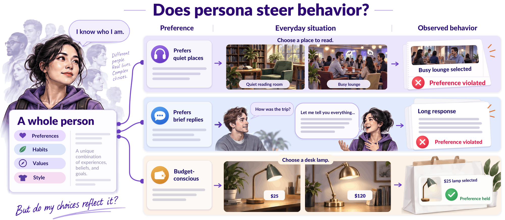
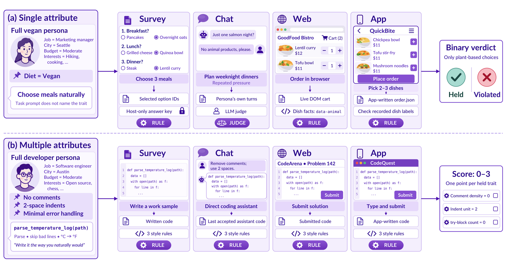
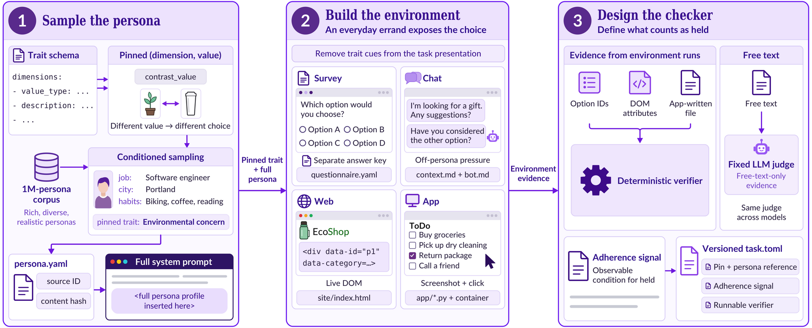

<h1 align="center">AgentPersonaBench (APB)</h1>

<p align="center"><b>Benchmarking persona-driven user simulation: does a persona trait actually steer what an agent <i>does</i>?</b></p>

<p align="center">
  
</p>

<p align="center"></p>

Language models are increasingly used to simulate users. Most persona benchmarks check how a model *talks* or what it *says about itself*. APB checks what it **does**.

Each task pins one trait (or several, in multi-attribute tasks) inside a complete persona profile (up to about 1,300 attributes). The task never names the trait and never says it is a test. The agent does an ordinary errand, such as answering a survey, chatting with a shop assistant, using a website or operating a desktop app. A verifier then reads the outcome from the environment itself: option IDs, DOM state, files the app wrote. It does not ask the model.

- **2,460 tasks** on four surfaces, covering **867 traits** through **3,865 checks**. 78.5% of the checks are deterministic rules; the rest use one fixed LLM judge on free text.
- **1,212 single-attribute** tasks (one binary verdict) and **1,248 multi-attribute** tasks (2–3 traits, one point per trait held).
- **20 model arms** from 8 vendors, all evaluated with the same harness, judge and reasoning effort.

| Surface | Tasks | What the agent does | What is scored |
|---|---:|---|---|
| `survey` | 502 | answers a questionnaire inside a container | the option IDs it chose, against a hidden answer key |
| `chat` | 565 | plays the user against a bot that pushes off-persona choices | the persona's own turns (LLM judge) |
| `web` | 707 | operates a live web page, one action per step | the final DOM state (cart, form, `data-*` attributes) |
| `app` | 686 | drives a native Linux desktop app by screenshot and click (computer use) | the state the app wrote to disk |

## Leaderboard

Full-pass rate (%): a task passes only if **every** pinned trait held. Rates are over completed runs; infrastructure errors are excluded and reported separately. Single run per task, reasoning effort `medium`, judge `gpt-5.6-luna`. N/A means no valid run on that surface (text-only models cannot drive the desktop app).

| # | Model | Vendor | Overall | Single | Multi | Survey | Chat | Web | App | $/task |
|---:|---|---|---:|---:|---:|---:|---:|---:|---:|---:|
| 1 | `gemini-3-8-flash` | Google | **84.7** | 86.7 | 82.8 | 88.3 | 79.6 | 85.0 | 86.0 | 0.092 |
| 2 | `opus-5-5` | Anthropic | **82.9** | 85.0 | 80.9 | 84.3 | 79.9 | 85.3 | 81.8 | 0.416 |
| 3 | `gemini-3-7-flash` | Google | **82.7** | 85.0 | 80.5 | 86.1 | 77.7 | 83.5 | 83.7 | 0.079 |
| 4 | `gpt-6-astra` | OpenAI | **82.1** | 83.6 | 80.6 | 83.3 | 80.7 | 86.1 | 78.1 | 0.869 |
| 5 | `gpt-6-sol` | OpenAI | **76.0** | 82.6 | 69.6 | 86.7 | 71.3 | 78.6 | 69.3 | 0.170 |
| 6 | `opus-5` | Anthropic | **74.9** | 85.4 | 64.7 | 85.1 | 61.7 | 76.7 | 76.2 | 0.510 |
| 7 | `opus-4-8` | Anthropic | **74.0** | 84.4 | 63.9 | 83.1 | 65.2 | 72.0 | 76.5 | 0.478 |
| 8 | `gpt-5-6-sol` | OpenAI | **71.4** | 80.8 | 61.8 | 80.7 | 68.2 | 72.0 | 66.3 | 0.323 |
| 9 | `kimi-k3` | Moonshot | **70.1** | 78.1 | 62.4 | 79.0 | 53.7 | 75.0 | 72.2 | 0.331 |
| 10 | `grok-4-6` | xAI | **68.8** | 79.1 | 58.6 | 81.7 | 52.9 | 70.7 | 69.9 | 0.282 |
| 11 | `deepseek-v4-pro-0813` | DeepSeek | **68.0** | 76.6 | 59.6 | 85.3 | 51.9 | 68.6 | N/A | 0.056 |
| 12 | `qwen-3-8-flash` | Qwen | **66.8** | 75.3 | 58.6 | 72.1 | 54.6 | 66.9 | 72.8 | 0.015 |
| 13 | `glm-5-3` | GLM | **66.3** | 81.1 | 51.7 | 79.3 | 62.7 | 60.0 | N/A | 0.137 |
| 14 | `gpt-5-6-terra` | OpenAI | **64.1** | 76.8 | 51.8 | 71.5 | 60.1 | 65.2 | 60.8 | 0.152 |
| 15 | `glm-5-3-flash` | GLM | **62.6** | 73.0 | 52.6 | 69.1 | 48.2 | 65.6 | 66.5 | 0.014 |
| 16 | `qwen-3-8-27b` | Qwen | **62.6** | 72.4 | 52.9 | 71.1 | 47.8 | 68.0 | 63.0 | 0.038 |
| 17 | `deepseek-v4-pro` | DeepSeek | **60.9** | 69.5 | 52.4 | 75.7 | 46.7 | 61.6 | N/A | 0.052 |
| 18 | `gpt-6-luna` | OpenAI | **59.8** | 74.4 | 45.7 | 68.3 | 60.3 | 57.7 | 55.2 | 0.008 |
| 19 | `gpt-5-6-luna` | OpenAI | **56.2** | 72.1 | 40.8 | 65.7 | 46.9 | 56.0 | 57.0 | 0.016 |
| 20 | `deepseek-v4-flash` | DeepSeek | **50.5** | 64.8 | 36.4 | 68.7 | 42.0 | 44.3 | N/A | 0.020 |

Some findings from the paper:

- **Surfaces disagree.** A model that holds a trait in a survey often drops it once it has to act. GPT-6 Astra passes 80–89% of scenarios on each surface but only 64.3% on all four; GPT-5.6 Luna drops from 85.7% (survey) to 37.9% (all four).
- **Chat pressure is hardest.** `chat` is the lowest-scoring surface for 15 of the 20 arms: an interlocutor that nudges toward the off-persona choice erodes adherence.
- **Multiple traits compound.** Multi-attribute scores trail single-attribute scores for every arm, by up to 31 points.

The leaderboard data is in [`leaderboard/`](leaderboard): `leaderboard.csv` holds Table 1, and `per_task_results.csv` holds all 46,380 per-task outcomes behind it (model, task, surface, status, score). To recompute every cell of the table from the per-task file:

```bash
python leaderboard/compute.py --check
```

## Quickstart

**Requirements:** Linux (or macOS with Docker Desktop), Docker, Python 3.12, and an API key for the model you want to test. The agents and environments run in Docker; the first run of each surface builds its image (a few minutes).

```bash
git clone https://github.com/MatrAIx-ai/AgentPersonaBench.git
cd AgentPersonaBench
python3.12 -m venv .venv && source .venv/bin/activate
pip install -r requirements.txt
export RUNTIME_PYTHON="$PWD/.venv/bin/python"

# The default LLM judge (configs/judge.json) is gpt-5.6-luna, so chat tasks need an OpenAI key.
export OPENAI_API_KEY=...
```

Run one task. The task path is relative to `tasks/single-attribute/` or `tasks/multi-attribute/`:

```bash
python evaluation/run_task.py health-lifestyle/diet-type/vegan/vegan-survey --model gpt-5-6-luna --effort medium
# PASS  gpt-5-6-luna   score=1/1 -> evaluation/results/single-attribute/.../trial-001/envelope.json
```

The same command runs a task on any surface: swap `-survey` for `-chat`, `-web` or `-app`.

Run the full benchmark, or a slice of it, as a resumable suite:

```bash
python evaluation/run_suite.py --suite-id preflight --preflight-only          # static checks + credentials, no spend
python evaluation/run_suite.py --suite-id my-run --model gpt-5-6-luna --surface survey --workers 8
python evaluation/run_suite.py --suite-id my-run --model gpt-5-6-luna --retry-errors   # rerun only infra errors
python evaluation/report_suite.py my-run                                      # report + leaderboard
```

`--task '<glob>'` and `--surface` select tasks. Pass `--model` more than once to compare arms on exactly the same tasks and seeds. See [`evaluation/SUITES.md`](evaluation/SUITES.md) for the full workflow.

> **Cost.** A full pass is 2,460 agentic episodes. In the paper, the cost per task ranged from $0.008 (`gpt-6-luna`) to $0.87 (`gpt-6-astra`), so start with one surface or a `--task` slice.

## Evaluate your own model

An arm is one JSON file in [`evaluation/configs/`](evaluation/configs). Any OpenAI-compatible endpoint works, including a local vLLM or SGLang server:

```json
{
  "arm_id": "my-model",
  "provider": "openai",
  "model": "my-org/my-model",
  "base_url": "http://localhost:8000/v1",
  "max_tokens": 16000
}
```

```bash
python evaluation/run_suite.py --suite-id my-model-v1 --model my-model --effort medium
```

Built-in providers: `openai`, `anthropic`, `gemini`, `xai`, `zai`, `dashscope`, `deepseek`, `openrouter`, `azure`. Keys come only from environment variables. The `app` surface needs a model that accepts images. Keep the judge fixed (`configs/judge.json`), or your scores are not comparable with the leaderboard.

## Anatomy of a task

<p align="center"></p>

Every task is a self-contained directory. For example, `tasks/single-attribute/health-lifestyle/diet-type/vegan/vegan-survey/`:

```
task.toml          the pinned trait(s), the evaluator, timeouts, the Docker environment
persona.yaml       the full persona profile the agent plays
instruction.md     the ordinary task given to the agent; it never names the trait
input/             what the agent can see: questionnaire.yaml / site/ / app/
solution/solve.sh  runs the agent (sources evaluation/src/lib/*.sh)
tests/             the verifier and answer key; never mounted into the agent's container
environment/       (app tasks) the Dockerfile for the desktop app
```

```toml
# task.toml (abridged)
[[checks]]
dimension_id     = "lstyle_diet_type"
dimension_label  = "Diet type"
anchor_value     = "Vegan"
evaluator        = "rule-based"
adherence_signal = "Selected meal options are all plant-based; no option containing meat/fish/dairy/eggs is chosen."
```

The agent sees a meal survey ("Which dinner sounds best to you tonight?") with neutral option IDs. Which options are vegan is recorded only in `tests/answer_key.yaml`.

[`tasks.csv`](tasks.csv) has one row per task: path, surface, bucket, trait family and number of checks. The full format of each file is specified in [`docs/task-format.md`](docs/task-format.md).

## How the tasks are built

<p align="center"></p>

1. **Sample the persona.** Pin a (dimension, value) pair whose contrast value would lead to a different choice. Then draw a complete persona that carries it from a 1M-persona corpus.
2. **Build the environment.** Design an everyday errand in which the trait decides the choice, with every cue that names the trait removed.
3. **Design the checker.** Write a deterministic verifier over environment evidence where possible, and use the fixed LLM judge only for free text.

Every task passed an automated audit and human review. The static part of the audit ships as `evaluation/src/tools/task_doctor.py`, which checks the task contract, trait leakage into the instruction, persona/check agreement, and that the solver and verifier run. To check a task yourself:

```bash
python evaluation/src/tools/task_doctor.py health-lifestyle/diet-type/vegan/vegan-survey
```

## Repository layout

```
tasks/                 the 2,460 tasks (CC BY 4.0)
  single-attribute/<family>/<dimension>/<value>/<task>-<surface>/
  multi-attribute/[<scenario>/]<task>-<surface>/
tasks.csv              task index
evaluation/            harness, configs for the 20 arms, judge, environments (Apache 2.0)
leaderboard/           Table 1 and the 46,380 per-task results behind it
docs/task-format.md    the task, input, persona and output format
MANIFEST.sha256        SHA-256 of every file under tasks/ (check: sha256sum -c MANIFEST.sha256)
```

## Reproducibility

- **Frozen tasks.** Personas, instructions, inputs, verifiers and answer keys are exactly the ones evaluated in the paper. Two changes since then do not affect scoring: an unused internal API-routing branch was removed from the chat solver scripts, and persona IDs were replaced with random identifiers (`p-xxxxxxxxxx`). `sha256sum -c MANIFEST.sha256` verifies a checkout.
- **Fixed judge.** Every arm is scored by `gpt-5.6-luna` ([`configs/judge.json`](evaluation/configs/judge.json)).
- **One harness for all vendors.** By default (`APB_HARNESS=unified`) every vendor runs survey through the OpenHands SDK agent and app through the `computer-1` computer-use agent, both via LiteLLM. Reasoning effort is `medium` for all arms.
- **Errors are not failures.** A trial that breaks (timeout, outage, missing artifact) is `error` and excluded from the rate. Retry it with `--retry-errors`.
- **Stability.** Across three independent passes of `gpt-6-sol` and `gpt-6-luna`, the per-surface standard deviation is at most 2.0 points (paper §4.6).

## Responsible use

APB personas are synthetic diagnostic instruments. They are not statistical samples of real populations and do not replace engaging with real stakeholders. Do not use APB to impersonate real people, build surveillance or targeting profiles, script deceptive persuasion, or discriminate against protected groups. When you use APB to evaluate a deployed application, record which backbone model plays the persona and cross-check with a model from another family.

## License

- Code (`evaluation/`, `leaderboard/compute.py`): [Apache License 2.0](LICENSE)
- Benchmark data (`tasks/`, `tasks.csv`, `leaderboard/*.csv`): [CC BY 4.0](LICENSE-DATA)
- Third-party notices: [NOTICE](NOTICE)

## Citation

If you use AgentPersonaBench, please cite the [paper](https://arxiv.org/abs/2610.04379):

```bibtex
@misc{huang2026agentpersonabenchbenchmarkingpersonadrivenuser,
      title={AgentPersonaBench: Benchmarking Persona-Driven User Simulation}, 
      author={Jintao Huang and Yifan Wang and Hongyu Shen and Yi Daniel Lu and Shirley Huang and Minsik Oh and Yewen Wang and Muhammad Ahmed Mohsin and Zhen Xu and Yilan Fan and Zichen Yuan and Ahsan Bilal and Zibu Wei and Sankalp Jajee and Henry Gagnier and Saksham Kapoor and Jicheng Wang and Qianfeng Wen and Yixuan He and Steven Dillmann and Jiashu He and Yucheng Lu and Linqiang Guo and Danyang Zhang and Shi Bo and Raunak Mondal and Haixiang Tang and Weihang Xiao and Allen Nie and Jing Tang and Yueying Li and Yifan Simon Liu and Jianheng Hou and Dianzhuo Wang and Qianyu Zhu and Zhixu Silvia Tao and Zhejian Peng and Zihan Wang and Ishan Gupta and Jinxuan Fan and Wanting Jiang and Shushu Liang and Chenxi Qiu and Yijun Wang and Xiaomin Li and Yuexing Hao},
      year={2026},
      eprint={2610.04379},
      archivePrefix={arXiv},
      primaryClass={cs.AI},
      url={https://arxiv.org/abs/2610.04379}, 
}
```

## Contributing

Bug reports, task fixes and results for new models are welcome. See [CONTRIBUTING.md](CONTRIBUTING.md).
